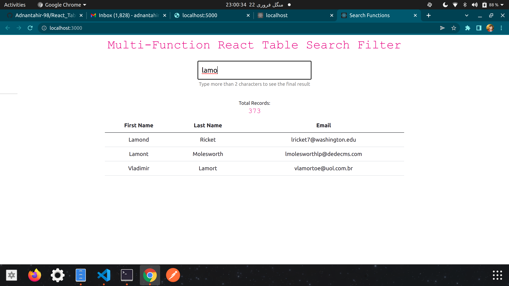

# React_Search_Api
React.js Search using backend api. can be modified pretty easily,

# <h2> To start the backend server go to node_api directory and run this command <code> "node index.js" </code> </h2>

# <h3> To run the React server you can go inside searchfilter directory and can run the command <code> "npm start" </code> </h3>

To start the searching you need to type more than 2 characters in the search bar field to see the final result or your search.

This 2 character condition can be removed to see the search results on each characters typed in the search bar you can go into App.js file in side useEffect Hook where the "filterUsers" function is executed to remove that 2 character condition...
